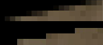
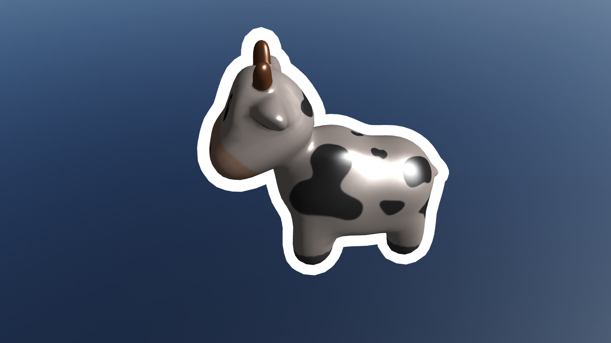
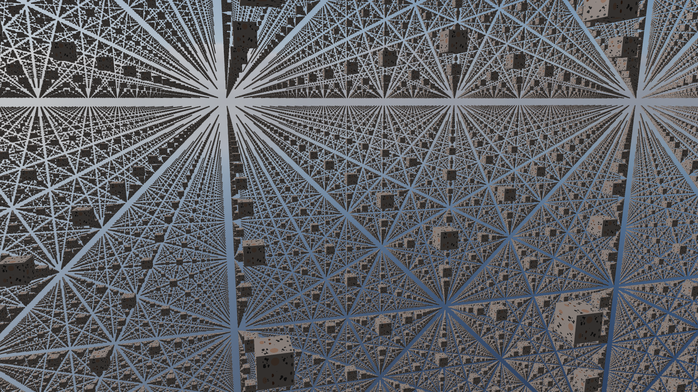

# OpenGL Renderer

This is a basic 3D renderer written in C++ and OpenGL. Its main purpose has been
for me to learn more rendering techniques while abstracting them into an API
that allows for scene creation without making OpenGL calls. Along the way, it
has improved my C++ skills, although I'm learning that C++ (and graphics
programming for that matter) is really a lifelong journey.

## Building and Running

Run tasks.py or open the project in your IDE. This python script mananages build
directories and build modes to streamline the process. Running the CMake
commands yourself is another option.

```shell
# Run in Debug mode
python tasks.py -r

# Specify Mode: [Debug, RelWithDebInfo, Release]
python tasks.py -r --mode Release

# Build Only
python tasks.py -b

# Clean
python tasks.py -c
```

## Features

- 3D model loading
- Orbit/FPS cameras
- Skybox
- Blinn-Phong lighting: Ambient, Diffuse, Specular, Emission maps
- MSAA
- Stencil Outlining (eventually object selection)
- Dockable ImGui interface
- Screenshots

### MSAA

By rendering to a multi-sampled framebuffer and blitting (copying, and in this
case, taking the average) it to a single sampled frambuffer to render to the
screen or perform post-processing.



### Stencil Testing

Objects can be outlined with a stencil by rendering to a stencil buffer with a
shader that increases object size and draws a single color, followed by drawing
the object normally. I've had issues with scaling, since some models are much
larger, so it was difficult to define a single outline strength.



### Instancing

Any model can be instanced



## TODO (soon to far)

- Turn into a library rather than coupling demos and scenes with the renderer.
- Uniform buffer objects (uniforms across shaders)
- PBR
- Rewrite in OpenGL 4.6 with data oriented approach (batched rendering, direct
  state access)
- Learn Vulkan

## What I've Learned

### CMake

In my long journey moving from CLion on MacOS to Neovim on both MacOS and Linux,
I realized the importance of learning CMake from the CLI and making it simple to
[build and run](#building-and-running) the project on different platforms.
Rather than simply clicking the run button and expecting things to work
cross-platform with no issues, I wrote a python script to make it simple to
build and run the project without worrying about making the correct folders,
specifying build mode, and finding the executable. This is the first CMake
project I'm using the script for, but it streamlines my ability to run code from
the terminal without a fancy run button. Using an alias "pt" for "python3
tasks.py", I type "pt -r" in a second Tmux window, rather than fumbling for the
mouse.

### OpenGL & C++

[LearnOpenGL](https://learnopengl.com/Introduction) has been a useful reference
for many foundational techniques. My C++ skills have certainly improved
throughout this project and since my previous attempts, although there are
certainly still many flaws in the code structure. I've tried to avoid
inheritance as much as possible, although it's difficult to write in a fully
procedural way, as using inheritance for key rendering classes would not scale
due to poor cache coherence. If I were to start fresh, I would avoid having
scenes extend the base scene class and instead use a component or
[ECS](https://en.wikipedia.org/wiki/Entity_component_system).

### Graphics Debugging

After I started developing on Linux, I was able to use Renderdoc, a
life-changing tool compared to only using log macros without the ability to
trace through OpenGL calls. I hadn't been able to use it previously being on
MacOS, and being able to see the exact state and order of each call was
extremely useful in finding where issues were located.

## Dependencies

- [GLFW](https://github.com/glfw/glfw): window creation and OpenGL context
  management
- [GLAD](https://glad.dav1d.de/): OpenGL function loader
- [stb_image](https://github.com/nothings/stb): Image loading
- [GLM](https://github.com/g-truc/glm): Math
- [ImGui](https://github.com/ocornut/imgui): GUI

## References

- [LearnOpenGL](https://learnopengl.com/Introduction): Much learning and some
  textures
- [GEngine](https://github.com/JuanDiegoMontoya/Gengine/tree/37739ecfcb608f6b282b36ed8a962fac968b1487):
  Inspiration for input handling with GLFW, and the HashedString class which
  itself was inspired by [Entt](https://github.com/skypjack/entt).
